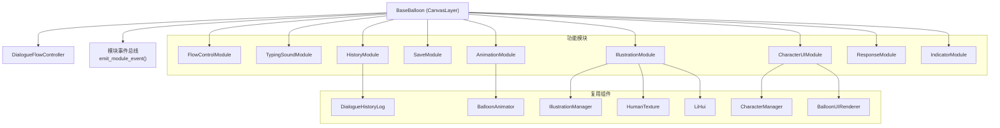
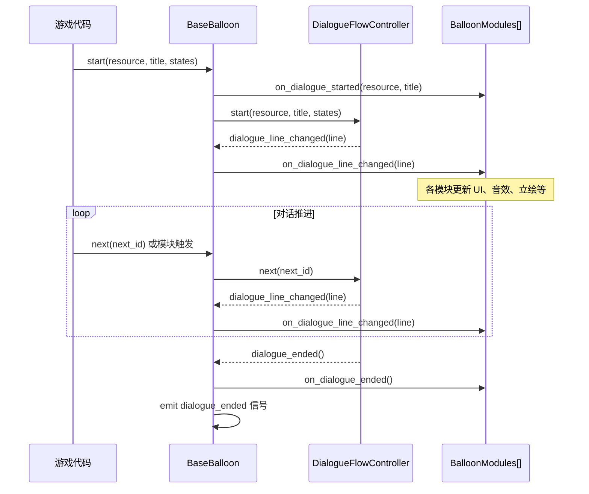
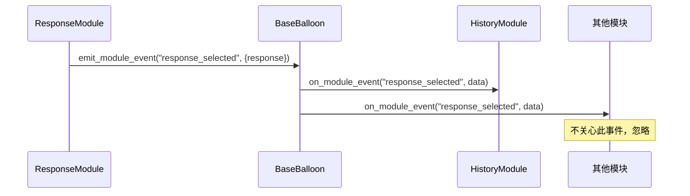

# 设计文档：模块化对话气球系统（Modular Dialogue Balloon System）

## 概述

本系统将现有的 `EnhancedBalloon`、`IllustratedBalloon` 等气球实现重构为一个统一的 `BaseBalloon` 核心节点，并将各功能拆分为可独立挂载的 `BalloonModule` 子节点。开发者可按需组合模块，无需修改核心代码。

系统基于 Godot 4 和 `dialogue_manager` 插件构建，复用并优化现有的 `BalloonAnimator`、`CharacterManager`、`DialogueFlowController`、`BalloonUIRenderer`、`IllustrationManager`、`DialogueHistoryLog`、`HumanTexture`、`LiHui` 等组件。

### 设计目标

- **高内聚低耦合**：每个模块只负责单一职责，模块间通过事件总线通信
- **按需组合**：开发者可自由挂载/卸载模块，不影响核心气球逻辑
- **向后兼容**：现有代码中的组件（BalloonAnimator 等）直接复用，不做破坏性修改
- **可测试性**：各模块逻辑独立，便于单元测试和属性测试

---

## 架构

### 整体架构图



### 对话生命周期时序



### 模块事件总线时序



---

## 组件与接口

### BaseBalloon

核心气球节点，继承 `CanvasLayer`。只负责对话生命周期管理和模块调度，不包含任何具体功能逻辑。

```gdscript
class_name BaseBalloon
extends CanvasLayer

signal dialogue_started(resource: DialogueResource, title: String)
signal dialogue_line_changed(line: DialogueLine)
signal dialogue_ended()

# 公共 API
func start(resource: DialogueResource, title: String = "", extra_states: Array = []) -> void
func next(next_id: String = "") -> void
func register_module(module: BalloonModule) -> void
func unregister_module(module: BalloonModule) -> void
func emit_module_event(event_name: String, data: Dictionary) -> void

# 内部
var _flow_controller: DialogueFlowController
var _modules: Array[BalloonModule] = []
```

**关键设计决策**：
- `_modules` 数组按注册顺序调用，保证确定性
- 模块回调用 `try/catch` 包裹，单个模块异常不影响其他模块
- `mutated` 信号处理：收到后设置 `will_hide_balloon = true`，经 0.1 秒冷却后通知模块并隐藏气球

### BalloonModule（基类）

所有功能模块的基类，继承 `Node`。

```gdscript
class_name BalloonModule
extends Node

@export var is_enabled: bool = true

var _balloon: BaseBalloon  # 弱引用宿主

func setup(balloon: BaseBalloon) -> void  # 注入宿主引用
func get_module_name() -> String          # 返回模块唯一标识

# 虚方法，子类重写
func on_dialogue_started(resource: DialogueResource, title: String) -> void
func on_dialogue_line_changed(line: DialogueLine) -> void
func on_dialogue_ended() -> void
func on_input(event: InputEvent) -> bool  # 返回 true 表示消费该事件
func on_module_event(event_name: String, data: Dictionary) -> void
```

**自动注册机制**：`BalloonModule._enter_tree()` 检查父节点是否为 `BaseBalloon`，若是则自动调用 `setup` 并注册。

### FlowControlModule

封装 `DialogueFlowController`，管理对话推进、自动推进、速度控制。

```gdscript
class_name FlowControlModule
extends BalloonModule

@export var auto_advance: bool = false
@export var auto_advance_delay: float = 1.5
@export_enum("fixed", "text_length") var auto_advance_mode: String = "text_length"
@export var auto_advance_text_multiplier: float = 0.03
@export var fast_forward_speed: float = 5.0
@export var slow_motion_speed: float = 0.3
@export var base_typing_speed: float = 0.02
@export var next_action: StringName = &"ui_accept"
@export var skip_action: StringName = &"ui_cancel"

var current_speed_multiplier: float = 1.0
var dialogue_label: DialogueLabel  # 由宿主注入

func toggle_auto_advance() -> void
func get_module_name() -> String: return "flow_control"
```

### TypingSoundModule

监听 `DialogueLabel.spoke` 信号，按角色音调播放打字音效。

```gdscript
class_name TypingSoundModule
extends BalloonModule

@export var typing_sound_enabled: bool = true
@export var default_pitch: float = 1.0
@export var pitch_variance: float = 0.1
@export var sound_interval: int = 2
@export var typing_sound: AudioStream

var _audio_player: AudioStreamPlayer
var _character_manager: CharacterManager  # 由宿主注入

func get_module_name() -> String: return "typing_sound"
```

### HistoryModule

持有 `DialogueHistoryLog` 引用，记录对话历史。

```gdscript
class_name HistoryModule
extends BalloonModule

@export var history_enabled: bool = true
@export var chapter_name: String = ""
@export var max_history_entries: int = 200
@export var history_action: StringName = &"ui_text_submit"

var history_log: DialogueHistoryLog  # 由场景树配置

func get_module_name() -> String: return "history"
```

### SaveModule

对接 `SaveSystem` 单例，自动保存对话进度。

```gdscript
class_name SaveModule
extends BalloonModule

@export var auto_save_progress: bool = true
@export var chapter_name: String = ""

func get_module_name() -> String: return "save"
```

### AnimationModule

持有 `BalloonAnimator` 实例，管理气球入场/出场动画。

```gdscript
class_name AnimationModule
extends BalloonModule

@export var enable_enter_animation: bool = true
@export var enable_exit_animation: bool = true
@export_enum("scale","fade","pop","slide_up","slide_down","none") var enter_animation_type: String = "scale"
@export_enum("scale","fade","pop","slide_up","slide_down","none") var exit_animation_type: String = "scale"
@export var animation_duration: float = 0.25
@export var response_animation_delay: float = 0.05

var balloon_control: Control          # 气球 Control 节点引用
var responses_menu: DialogueResponsesMenu

func get_module_name() -> String: return "animation"
```

### IllustrationModule

持有 `IllustrationManager` 引用，管理立绘显示与焦点。

```gdscript
class_name IllustrationModule
extends BalloonModule

@export var fade_duration: float = 0.3

var illustration_manager: IllustrationManager  # 由场景树配置

func switch_illustration(position: int, resource: LiHui, default_key: String = "ax") -> void
func get_module_name() -> String: return "illustration"
```

### CharacterUIModule

持有 `CharacterManager` 和 `BalloonUIRenderer`，更新角色 UI。

```gdscript
class_name CharacterUIModule
extends BalloonModule

@export_enum("left","right","auto") var balloon_direction: String = "auto"

var character_manager: CharacterManager
var ui_renderer: BalloonUIRenderer  # 由场景树配置

func register_character(name: String, config: Dictionary) -> void
func set_expression(expression: String) -> void
func get_module_name() -> String: return "character_ui"
```

### ResponseModule

持有 `DialogueResponsesMenu`，处理响应选项显示与选择。

```gdscript
class_name ResponseModule
extends BalloonModule

signal response_selected(response: DialogueResponse)

var responses_menu: DialogueResponsesMenu  # 由场景树配置

func get_module_name() -> String: return "response"
```

### IndicatorModule

监听 `FlowControlModule` 状态，更新 HUD 指示器。

```gdscript
class_name IndicatorModule
extends BalloonModule

var auto_advance_indicator: Label   # 由场景树配置
var speed_indicator: Label          # 由场景树配置
var _flow_module: FlowControlModule # 从宿主查找

func get_module_name() -> String: return "indicator"
```

---

## 数据模型

### CharacterConfig（CharacterManager 内部类）

```gdscript
class CharacterConfig extends RefCounted:
    var character_name: String
    var pitch: float = 1.0
    var direction: String = "left"   # "left" | "right"
    var color: Color = Color.WHITE
    var textures: Dictionary         # expression_key -> Texture2D
    var bg_textures: Dictionary      # "BG"|"NAME"|"HEAD" -> Texture2D
    var head_offset: Vector2
    var name_offset: Vector2
    var name_scale: Vector2
```

### LiHui（扩展后）

```gdscript
class_name LiHui
extends Resource

@export var character_name: String
@export var sprites: Dictionary[String, Texture2D]
@export var default_expression: String = "ax"      # 新增
@export var default_direction: String = "left"     # 新增
@export var character_color: Color = Color.WHITE   # 新增

func has_expression(key: String) -> bool
func get_expression_keys() -> Array[String]
```

### BalloonAnimator.AnimConfig

```gdscript
class AnimConfig extends RefCounted:
    var anim_type: int          # AnimType 枚举
    var duration: float = 0.3
    var delay: float = 0.0
    var transition_type: int
    var ease_type: int
    var scale_from: Vector2
    var fade_from: float
    var fade_to: float
    var pop_scale: float
    var pop_bounce: float
    var slide_distance: float
```

### 模块事件数据约定

| 事件名 | data 字段 | 发送方 | 接收方 |
|--------|-----------|--------|--------|
| `response_selected` | `{ response: DialogueResponse }` | ResponseModule | HistoryModule |
| `typing_finished` | `{ line: DialogueLine }` | FlowControlModule | IndicatorModule |
| `speed_changed` | `{ multiplier: float }` | FlowControlModule | IndicatorModule |
| `auto_advance_changed` | `{ enabled: bool }` | FlowControlModule | IndicatorModule |

### IllustrationPosition 枚举

```gdscript
enum IllustrationPosition { LEFT = 0, RIGHT = 1, CENTER = 2 }
```

### AnimType 枚举

```gdscript
enum AnimType { SCALE, FADE, SLIDE_UP, SLIDE_DOWN, SLIDE_LEFT, SLIDE_RIGHT, POP, NONE }
```

---

## 正确性属性

*属性（Property）是在系统所有合法执行路径上都应成立的特征或行为——本质上是对系统应做什么的形式化陈述。属性是人类可读规范与机器可验证正确性保证之间的桥梁。*

### 属性 1：生命周期回调全覆盖

*对于任意* 已注册到 BaseBalloon 的模块集合，当对话生命周期事件（started / line_changed / ended）触发时，集合中每个模块的对应回调方法都应被调用恰好一次。

**验证：需求 1.4、1.5、1.6**

---

### 属性 2：模块注册/注销 Round-Trip

*对于任意* BalloonModule 实例，将其注册到 BaseBalloon 后，该模块应出现在内部模块列表中；注销后，该模块不应再出现在列表中，且后续生命周期回调不再调用该模块。

**验证：需求 1.7**

---

### 属性 3：is_enabled=false 时跳过所有回调

*对于任意* BalloonModule，当其 `is_enabled` 属性为 `false` 时，无论触发何种生命周期事件或模块事件，该模块的所有回调方法都不应被执行。

**验证：需求 2.4**

---

### 属性 4：子节点自动注册

*对于任意* BalloonModule 子类实例，当其作为 BaseBalloon 的直接子节点加入场景树时，该模块应自动完成注册，且 `_balloon` 引用指向正确的宿主。

**验证：需求 2.3**

---

### 属性 5：自动推进延迟计算正确性

*对于任意* 文本长度 `L`、`auto_advance_delay` 值 `D`、`auto_advance_text_multiplier` 值 `M`，当 `auto_advance_mode` 为 `text_length` 时，计算出的延迟应等于 `max(D, L * M)`，且该值始终不低于 `D`。

**验证：需求 3.3**

---

### 属性 6：音效播放条件正确性

*对于任意* 字符 `c`、字符索引 `i`、`sound_interval` 值 `n`、速度倍率 `s`，`should_play_sound(c, i, s)` 应当且仅当以下所有条件同时成立时返回 `true`：`c` 不是空格或标点、`i % effective_interval == 0`（其中 `effective_interval = 1 if s < 1.0 else n`）。

**验证：需求 4.2、4.3、4.4**

---

### 属性 7：角色音调范围约束

*对于任意* 已注册角色名 `name`、基础音调 `base`、音调偏差 `variance`，`TypingSoundModule` 计算出的最终音调应始终在 `[base - variance, base + variance]` 范围内。

**验证：需求 4.5**

---

### 属性 8：历史记录随对话行增长

*对于任意* 非空对话行序列，每次 `on_dialogue_line_changed` 被调用后，`DialogueHistoryLog` 中的条目数应恰好增加 1。

**验证：需求 5.1**

---

### 属性 9：新对话开始时历史清空

*对于任意* 已包含若干历史条目的 HistoryModule，当 `on_dialogue_started` 被调用时，历史记录应被清空（条目数归零）。

**验证：需求 5.4**

---

### 属性 10：响应菜单可见性与对话行一致

*对于任意* 对话行，ResponseModule 中响应菜单的可见性应与该对话行是否包含响应选项完全一致：包含响应时可见，不包含时隐藏。

**验证：需求 10.1、10.2**

---

### 属性 11：速度指示器显示状态正确性

*对于任意* 速度倍率值 `m`，IndicatorModule 的显示状态应满足：`m > 1.5` 时显示快进指示器，`m < 0.7` 时显示慢放指示器，`0.7 <= m <= 1.5` 时隐藏速度指示器。

**验证：需求 11.2、11.3、11.4**

---

### 属性 12：LiHui 表情键名 Round-Trip

*对于任意* 表情键名 `key` 和对应纹理 `texture`，将其加入 `LiHui.sprites` 后，`has_expression(key)` 应返回 `true`，且 `get_expression_keys()` 应包含 `key`。

**验证：需求 13.4、13.5**

---

### 属性 13：缺失表情键名静默跳过

*对于任意* 不存在于 `lihui_resource.sprites` 中的键名 `key`，调用 `HumanTexture.switch_lihui(key)` 后，节点不应崩溃，且当前纹理应保持不变。

**验证：需求 12.6**

---

### 属性 14：IllustrationManager 无匹配时全部非焦点

*对于任意* 不匹配任何已加载立绘角色名的字符串 `name`，调用 `set_focus_by_name(name)` 后，所有立绘节点的焦点状态应均为非焦点（缩小、半透明）。

**验证：需求 14.4**

---

### 属性 15：立绘交换 Round-Trip

*对于任意* 两个合法位置 `a` 和 `b`，调用 `swap_illustrations(a, b)` 后再调用 `swap_illustrations(a, b)`，两个位置的立绘资源应恢复为交换前的状态。

**验证：需求 14.5**

---

### 属性 16：模块事件按注册顺序广播

*对于任意* 已注册模块序列和任意事件名，调用 `emit_module_event` 后，各模块的 `on_module_event` 被调用的顺序应与模块注册顺序完全一致。

**验证：需求 15.1、15.4**

---

### 属性 17：单模块异常不影响后续模块

*对于任意* 包含至少两个模块的模块列表，若其中某个模块的回调抛出异常，后续所有模块的对应回调仍应被调用。

**验证：需求 15.5**

---

### 属性 18：输入事件消费后停止传播

*对于任意* 模块列表，若列表中第 `k` 个模块的 `on_input` 返回 `true`，则索引大于 `k` 的所有模块的 `on_input` 不应被调用。

**验证：需求 16.2**

---

## 错误处理

### 空资源保护

- `BaseBalloon.start()` 收到 `null` 资源时：输出 `push_error` 日志，立即返回，不修改任何状态
- `IllustrationModule` 收到 `null` 的 `IllustrationManager` 时：所有方法静默返回

### SaveSystem 缺失

- `SaveModule` 在每次保存前检查 `Engine.has_singleton("SaveSystem")`，不存在时静默跳过，不产生任何错误或警告

### 模块回调异常隔离

- `BaseBalloon` 在调用每个模块回调时使用异常捕获（GDScript 中通过检查返回值和 `push_error` 实现），确保单个模块的错误不级联影响其他模块

### 无效表情键名

- `HumanTexture.switch_lihui(key)` 在切换前检查 `lihui_resource.sprites.has(key)`，不存在时静默返回
- `LiHui.has_expression(key)` 提供安全的预检查接口

### 场景树节点失效

- 所有持有 `Control` 节点引用的模块在使用前调用 `is_instance_valid()` 检查，避免节点被释放后的访问错误

---

## 测试策略

### 双轨测试方法

本系统采用**单元测试**和**属性测试**相结合的方式：

- **单元测试**：验证具体示例、边界条件、错误处理路径
- **属性测试**：验证对所有合法输入都成立的普遍规律

两者互补，共同保证系统正确性。

### 属性测试配置

- 使用 GDScript 的属性测试库（推荐 [gdunit4](https://github.com/MikeSchulze/gdUnit4) 配合自定义生成器，或使用 Python/Hypothesis 对纯逻辑函数进行跨语言测试）
- 每个属性测试最少运行 **100 次迭代**
- 每个属性测试注释中标注对应设计属性，格式：
  `# Feature: modular-dialogue-balloon, Property {N}: {属性描述}`

### 属性测试列表

| 属性编号 | 测试描述 | 生成器策略 |
|----------|----------|------------|
| 属性 1 | 生命周期回调全覆盖 | 随机生成 1-10 个 mock 模块，随机触发生命周期事件 |
| 属性 2 | 注册/注销 Round-Trip | 随机生成模块，注册后注销，验证列表状态 |
| 属性 3 | is_enabled=false 跳过回调 | 随机模块 + 随机事件，验证禁用时无回调 |
| 属性 5 | 自动推进延迟计算 | 随机 L(0-1000)、D(0.5-5.0)、M(0.01-0.1) |
| 属性 6 | 音效播放条件 | 随机字符、索引、间隔、速度倍率 |
| 属性 7 | 音调范围约束 | 随机基础音调(0.5-2.0)、偏差(0-0.3) |
| 属性 8 | 历史记录增长 | 随机对话行序列(1-20条) |
| 属性 10 | 响应菜单可见性 | 随机包含/不包含响应的对话行 |
| 属性 11 | 速度指示器状态 | 随机速度倍率(0.1-20.0) |
| 属性 12 | LiHui 表情 Round-Trip | 随机键名字符串 |
| 属性 13 | 缺失键名静默跳过 | 随机不存在的键名 |
| 属性 16 | 事件广播顺序 | 随机模块数量和注册顺序 |
| 属性 17 | 异常隔离 | 随机位置插入抛异常的模块 |
| 属性 18 | 输入消费停止传播 | 随机消费位置 k |

### 单元测试列表

| 测试场景 | 对应需求 |
|----------|----------|
| start() 传入 null 资源不崩溃 | 1.10 |
| BalloonModule.setup() 正确注入宿主引用 | 2.2 |
| get_module_name() 返回非空字符串 | 2.5 |
| auto_advance 延迟计算边界值（L=0） | 3.3 |
| fast_forward 按键时速度倍率正确 | 3.4 |
| sound_interval 在慢速时强制为 1 | 4.4 |
| SaveSystem 不存在时静默跳过 | 6.2 |
| enable_enter_animation=false 时气球立即显示 | 7.6 |
| switch_lihui_resource 完成后透明度恢复 1.0 | 12.4 |
| set_focus_by_name 正确立绘获得焦点 | 14.3 |
| 对话开始时历史记录清空 | 5.4 |
| 响应选择后 response_selected 信号发出 | 10.3 |

### 测试文件结构建议

```
tests/
  unit/
    test_base_balloon.gd
    test_balloon_module.gd
    test_flow_control_module.gd
    test_typing_sound_module.gd
    test_history_module.gd
    test_save_module.gd
    test_response_module.gd
    test_indicator_module.gd
    test_lihui.gd
    test_human_texture.gd
    test_illustration_manager.gd
  property/
    test_prop_lifecycle.gd
    test_prop_flow_control.gd
    test_prop_typing_sound.gd
    test_prop_history.gd
    test_prop_indicator.gd
    test_prop_lihui.gd
    test_prop_event_bus.gd
```
